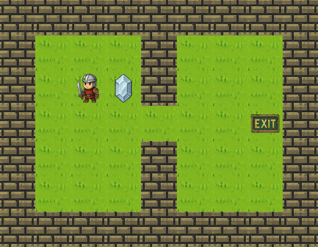
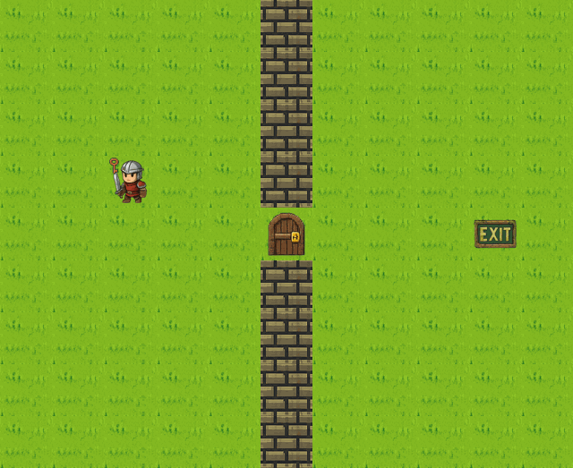
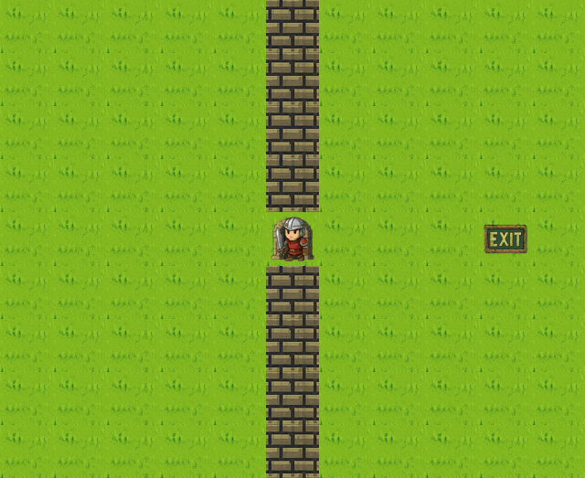
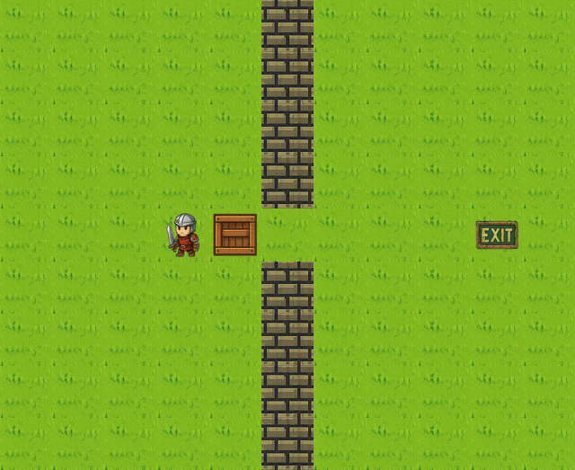
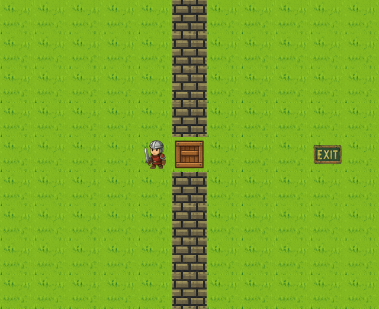

## Basic movements

In a turn, the Agent can move to an orthogonally adjacent tile (Up/Down/Left/Right)

#### Demo

The demo shows the Agent performing a move up action.

## Collectibles

If an Agent is on the same tile as a Collectible entity, the Agent can use a turn to collect it.

#### Demo

The Agent starts beside a Collectible Gem.

The Agent performs a move to the right to stand on the same tile as the Gem.

Now, the Agent can perform a collect action to pick up the gem. It is added to inventory.

## Key and Door

To unlock a door, the Agent must first collect a Key, then move to and unlock the door.

#### Demo

The Agent starts on the same tile as the Collectible Key. Agent can collect it.

To unlock the door, the Agent first needs to move adjacent to the door. Agent moves 2 steps to the right and 1 step down.

Then, the Agent uses the Key to unlock the door.

The door is no longer blocking and Agent is able to move onto the tile with the Door.

## Pushable Box

To push a box, Agent needs to stand adjacent to the Box and attempt to move in the direction to push the Box.

#### Demo

The Agent starts to the left of the box as shown in the grid.

Now, if the Agent attempts to move to the right, the Box will be pushed and Agent will move to the right.

